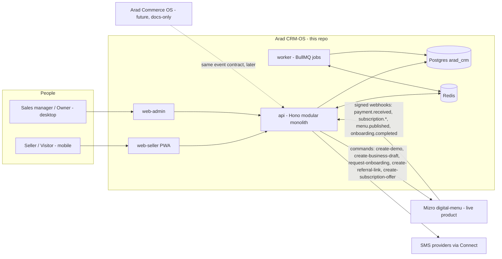

# Arad CRM-OS — Architecture Overview

> **Status:** `in-review` — awaiting founder approval · **Owner:** CTO · **Date:** 2026-07-18
> **Inputs:** `docs/product/product-description.md` (locked) · `digital-menu/docs/money/sales-os-crm.md` · `digital-menu/docs/_ideas/funder/crm-idea.md` (dev spec v0.1) · `digital-menu/docs/architecture/*` (esp. doc-29 extraction hygiene) · `ux-best-practices` repo.
> **Rule of this repo's docs:** mirrors Mizro's doc culture — numbered docs, ~150-line budget, status gate `in-review → approved`. 🔒 marks locked invariants.

## 1. What we are building (one paragraph)

A **modular-monolith, headless-core CRM** ("sales OS") in its own monorepo, sibling to Mizro (`digital-menu`) and the future Arad Commerce OS, standing on a **shared `arad-foundation`** of Tier-1 packages extracted from Mizro. Phase 1 ships the core loop for the Mizro pilot: daily plan → visit log → next-action → opportunity → demo-QR attribution → payment event from Mizro → **append-only commission ledger** → seller money panel + manager funnel.

## 2. System context



Payments never enter the CRM: Zarinpal/card-to-card live in Mizro (E53) / Commerce OS. The CRM consumes **payment events** only (🔒 sale = a real payment event, never a manual toggle).

## 3. Decision index

| ADR | Decision (short) | Doc |
|---|---|---|
| 001 | Standalone `arad-crm-os` monorepo + new `arad-foundation` repo (extracted Mizro Tier-1 packages, `@arad/*`) mounted as git submodule; Mizro migrates staged | [ADR-001](decisions/ADR-001-repo-topology.md) |
| 002 | Stack mirrors Mizro: pnpm/Turbo/Biome, TS-strict, Hono+Zod-OpenAPI, Next 15/React 19, Drizzle+Postgres 16 (own DB), BullMQ/Redis, Vitest; deploy on mvp-pool pipeline | [ADR-002](decisions/ADR-002-stack-tooling-deploy.md) |
| 003 | Modular monolith; module map = platform-core / sales-core / verticals; boundaries CI-enforced; 4 apps (api, worker, web-seller, web-admin) | [ADR-003](decisions/ADR-003-modular-monolith.md) |
| 004 | Multi-tenancy: `organization_id` on every tenant row, app-level `orgScope()` + AST guard, no RLS for now | [ADR-004](decisions/ADR-004-multi-tenancy.md) |
| 005 | Identity: reuse `@arad/auth-otp` (phone OTP + JWT cookie); authZ = static role catalog + per-module policy layer with own/team/org scopes | [ADR-005](decisions/ADR-005-identity-authz.md) |
| 006 | Integration: versioned event contract in `@arad/platform-events`; signed webhook + idempotent inbox + reconciliation; commands via Mizro partner API | [ADR-006](decisions/ADR-006-event-integration.md) |
| 007 | Commission: append-only ledger, versioned plan snapshots, 8-status machine, reversal-not-mutation, bigint Rial — E53 rigor | [ADR-007](decisions/ADR-007-commission-engine.md) |
| 008 | API: `/v1` REST, Zod contracts as single source of truth, OpenAPI at runtime, Idempotency-Key on seller mutations | [ADR-008](decisions/ADR-008-api-contracts.md) |
| 009 | Frontend: web-seller = consumer-mobile-app archetype (PWA, RTL, <2-min visit flow); web-admin = ops-admin-panel archetype; tokens via CSS-var theming contract; brand TBD | [ADR-009](decisions/ADR-009-frontend-design-system.md) |
| 010 | Verticals: packages + module registry per org; vertical owns its data + privacy regime; core stays lean; custom fields deferred | [ADR-010](decisions/ADR-010-vertical-extension-model.md) |
| 011 | Quality: two-tier Vitest (+ real-Postgres tests), golden commission scenarios, data-leak tests, ported CI guard scripts, Sentry+pino, append-only audit log | [ADR-011](decisions/ADR-011-quality-observability-audit.md) |

**Fit against the founder's five requirements** (fast flow · low bug risk · low maintenance · performance · flexibility): [01-requirements-fit.md](01-requirements-fit.md).

## 4. Planned workspace layout (scaffold target)

```
arad-crm-os/
├─ foundation/                  # git submodule → arad-foundation repo (@arad/*)
├─ apps/
│  ├─ api/                      # Hono; src/modules/<module>/ (routes+service+policy)
│  ├─ worker/                   # BullMQ jobs: reminders, cadences, reconciliation, rollups
│  ├─ web-seller/               # Next 15 PWA — «امروز من», visit flow, money panel
│  └─ web-admin/                # Next 15 — manager/owner dashboards, funnel, approvals
├─ packages/
│  ├─ db/                       # Drizzle schema + migrations + orgScope()
│  ├─ api-contracts/            # Zod SOT for all API shapes
│  ├─ commission/               # ledger engine (pure + db), golden tests
│  └─ verticals/mizro/          # cafe vertical: entities, visit fields, pipeline config, handlers
├─ docs/ · scripts/check-*.ts · deploy/ · turbo.json · pnpm-workspace.yaml
```

Module map (ADR-003): **platform-core** = identity · org/teams · audit · notifications · integrations(inbox/outbound) · files(seam). **sales-core** = accounts&contacts · leads · opportunities&pipeline · activities(visits/next-actions) · products&offers · attribution · commission · targets · reporting. **vertical** = mizro.

## 5. Phase-1 build order (money-lens, per product doc §18)

1. **Scaffold + foundation extraction wave 1** (ADR-001) — CI green from day 1.
2. **Commission ledger first**, pure engine + golden scenarios against fixture event streams (ADR-007) — before any UI.
3. Event inbox + Mizro emitter epic (ADR-006) — end-to-end `payment.received` → ledger entry on staging fixtures.
4. Sales-core spine: accounts/leads/opportunities/activities + attribution links.
5. web-seller core loop (امروز من → visit → next-action) ; web-admin funnel + approvals.
6. Pilot hardening: reconciliation sweep, audit, data-leak tests, seed import (cafe list + dedupe).

## 6. Founder decisions needed (beyond doc approval)

1. **Phase-0 workshop outputs** block schema finalization: final funnel stages (spec has 14), visit outcomes (14), win/loss reasons, ONE commission plan's parameters, attribution conflict rule.
2. **Mizro-side integration epic** (~small): event emitter, partner command endpoints, `?ref=` attribution stamping on demo links — needs a slot in digital-menu's roadmap.
3. **Foundation migration timing for digital-menu** (ADR-001): extracted packages are change-frozen in Mizro until it migrates; approve the freeze rule.
4. **Brand name** (affects package scope only cosmetically — `@arad-crm/*` used until then).

## 7. Top risks

| Risk | Mitigation |
|---|---|
| Event contract is one-sided (Commerce OS doc defines no events) | Contract lives in `@arad/platform-events`; Mizro implements first; Commerce OS adopts at its Sprint 0 — flagged to founder |
| Foundation extraction destabilizes live Mizro | Staged: CRM consumes foundation day 1; Mizro migrates later behind freeze rule; renames only, no behavior change |
| Commission disputes from ambiguous attribution | Phase-0 locked rule + append-only attribution claims + manager dispute queue (ADR-006/007) |
| Scope creep into generic CRM | Product doc §15 guardrails; module registry keeps core lean; verticals carry specificity |
